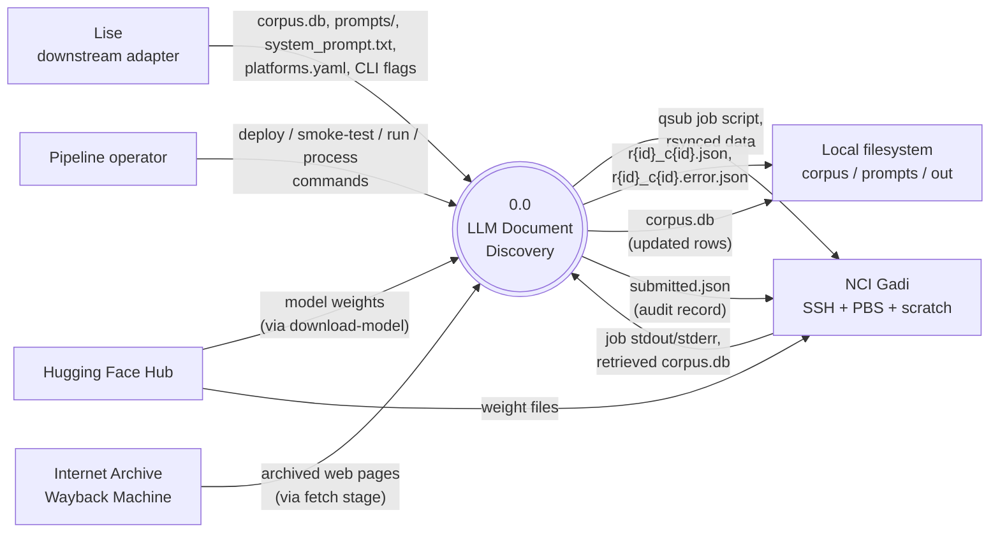

# Context Diagram (Level 0)

> System boundary: LLM Document Discovery pipeline

## Diagram

## External Entities

| Entity | Description | Inputs to System | Outputs from System |
|--------|-------------|------------------|---------------------|
| Lise (downstream adapter) | Vendoring project that drives `llm-discovery` as a black box for a 15-category safeguard rubric (`docs/design-plans/2026-04-23-run-config.md`). | Adapter-supplied paths (`--db`, `--system-prompt`, `--prompts-dir`, `--input-dir`, `--output-dir`), adapter's `platforms.yaml` (via `--config`), CLI flags. | Result and error JSON files at adapter-supplied `--output-dir`. |
| Pipeline operator | Human running `deploy` / `smoke-test` / `process` / `init` commands directly (`src/llm_discovery/cli.py::app`, `c93f5bb`). | CLI invocations with flag overrides. | Console output (Rich-formatted), exit codes, log files. |
| Internet Archive Wayback Machine | Source of archived historical web documents for the demo / fetch path (`src/llm_discovery/fetch.py::fetch_single`, `c93f5bb`). | Wayback URL patterns + timestamps. | HTML responses converted to markdown by `markdownify`. |
| Hugging Face Hub | Model registry source (`src/llm_discovery/cli.py::download_model`, `c93f5bb`). | Model identifier from `JobType.hf_repo` (planned, `docs/design-plans/2026-04-23-run-config.md`). | Model weight files cached locally (`$HF_HOME`). |
| NCI Gadi | HPC scheduler + scratch filesystem (`src/llm_discovery/platform.py::submit_gadi_job`, `c93f5bb`). | Rendered PBS scripts, rsynced data dirs, container `.sif` images, model weights. | Job stdout / stderr / completion status; updated `corpus.db` retrieved via rsync. |
| Local filesystem | Working tree on the operator / adapter machine. | Corpus markdown files in `--input-dir`, prompts YAML in `--prompts-dir`, system prompt at `--system-prompt`. | Per-pair JSON files at `--output-dir` (success and error). |

## System Boundary

**In scope:**
- Fetching documents (optional, for the demo path) (`src/llm_discovery/fetch.py`, `c93f5bb`).
- Building / populating the corpus DB (`src/llm_discovery/prep_db.py::run_prep_db`, `c93f5bb`).
- Running classification via vLLM (`src/llm_discovery/unified_processor.py::run_processor`, `c93f5bb`).
- Importing JSON results into the DB (`src/llm_discovery/import_results.py::run_import`, `c93f5bb`).
- Orchestrating local Apptainer or remote Singularity execution paths (`src/llm_discovery/local_runner.py`, `src/llm_discovery/platform.py`, `c93f5bb`).
- Submitting and monitoring PBS jobs on Gadi (`src/llm_discovery/platform.py::submit_gadi_job`, `c93f5bb`).
- Validating job-type configurations against PBS resource caps before submission (planned, `docs/design-plans/2026-04-23-run-config.md`).

**Out of scope:**
- Authentication and authorisation (relies on operator's pre-configured SSH keys and Hugging Face tokens).
- vLLM server internals (treated as a black-box `/v1/chat/completions` endpoint).
- Adapter's prompt engineering or category rubric authorship (Lise owns this).
- PBS scheduler internals (job dispatch, queueing, accounting).
- Hugging Face authentication and download protocol.
- Internet Archive availability and rate limiting.

## Cross-References

- **Parent:** None (this is the top-level diagram).
- **Children:** None yet — Level-1 decomposition would split the central process into fetch / prep-db / preflight / process / import-results / submit / smoke-test subsystems if/when needed.
- **Related design plans:**
  - `docs/design-plans/2026-04-23-run-config.md` — externalises configuration for the Lise adapter use case
  - `docs/design-plans/2026-04-09-reproducible-demo.md`, `2026-04-11-gadi-deploy-automation.md`, `2026-04-12-apptainer-pipeline.md`, `2026-04-13-container-cli-verbs.md` — earlier design history
- **Related commits:**
  - `c93f5bb` — current HEAD (post commit-1 of run-config design)
  - `26c6059` — Apptainer container pipeline
