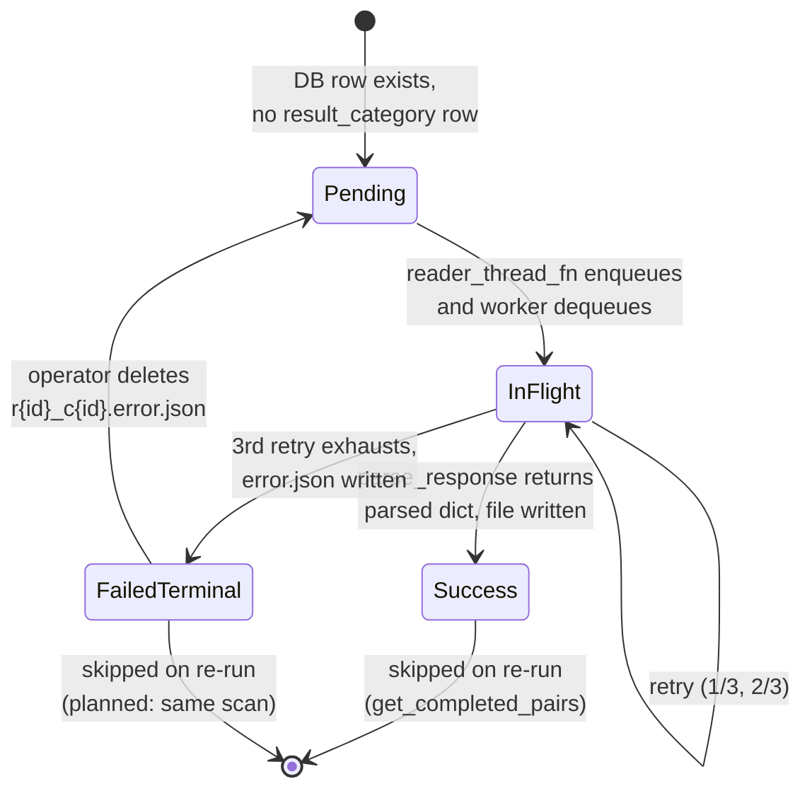

# Pair Lifecycle

A "pair" is one (document, category) combination — a single unit of classification work. Each pair is processed independently, retried up to three times, and produces exactly one terminal artefact (success or failure JSON) when classification completes.

## State Diagram

## States

| State | Description | Entry Conditions | Exit Conditions |
|-------|-------------|------------------|-----------------|
| **Pending** | The (result_id, category_id) cross-product row exists in the DB but no `result_category` row links them; no `r{id}_c{id}.json` or `r{id}_c{id}.error.json` exists in `--output-dir`. | Document and category rows present in `result` and `category` tables (`schema.sql`, `c93f5bb`); reader query at `src/llm_discovery/unified_processor.py::reader_thread_fn` enumerates this cross-product (`c93f5bb`). | The reader thread enqueues this pair onto the work queue. |
| **InFlight** | Worker thread holds an active or in-flight HTTP request to the vLLM server for this pair. May be the first attempt or a retry (up to 2 retries, 3 total attempts). | Pair dequeued from the work queue; `do_request` invoked (`src/llm_discovery/unified_processor.py::do_request`, `c93f5bb`). | Request returns; `parse_response` succeeds → Success; or `parse_response` fails and `retries < 3` → re-enter InFlight; or `retries == 3` → FailedTerminal. |
| **Success** | A successful classification produced `out/r{id}_c{id}.json` containing match value, reasoning trace, blockquotes, and (planned) `filepath` + `category_name` (`docs/design-plans/2026-04-23-run-config.md`). | `parse_response` returned a parsed dict and `save_result_to_file` atomically renamed the temp file (`src/llm_discovery/unified_processor.py::save_result_to_file`, `c93f5bb`). | Re-runs of `process` skip this pair via `get_completed_pairs` glob match (`src/llm_discovery/unified_processor.py::get_completed_pairs`, `c93f5bb`). |
| **FailedTerminal** | Three retries exhausted without successful parse. (Planned) An `out/r{id}_c{id}.error.json` records the failure reason, full last response content, reasoning trace, and transport-level error (`docs/design-plans/2026-04-23-run-config.md`). | `_handle_completed_future` increments `stats["failed"]` after the third failed attempt (`src/llm_discovery/unified_processor.py::_handle_completed_future`, `c93f5bb`); planned: `save_failure_to_file` writes `r{id}_c{id}.error.json` (`docs/design-plans/2026-04-23-run-config.md`). | Re-runs skip via `get_completed_pairs` extension to glob `*.error.json` (planned). Operator deletion of the `.error.json` file restores the pair to Pending (manual retry escape hatch). |

## Transitions

| From | To | Trigger | Side Effects | Reversible? |
|------|----|---------|--------------|-------------|
| Pending | InFlight | Reader enqueues, worker dequeues, executes `do_request`. | HTTP request sent to `/v1/chat/completions`; `Metrics.record_request_time` accumulates. | No (in-flight request cannot be cancelled). |
| InFlight | InFlight (retry) | `parse_response` returns `(None, reason)` AND `retries < 3` (`src/llm_discovery/unified_processor.py::_handle_completed_future`, `c93f5bb`). | A new future is submitted to the executor with `retries + 1`. | No (each attempt is independent). |
| InFlight | Success | `parse_response` returns `(parsed_dict, None)`; `save_result_to_file` writes atomically. | `stats["saved"]` incremented; per-pair JSON written to `--output-dir`. | No (success is terminal under current and planned behaviour). |
| InFlight | FailedTerminal | `parse_response` returns `(None, reason)` AND `retries == 3`. | (Current) `stats["failed"]` incremented; reason discarded. (Planned) `save_failure_to_file` writes `.error.json` with `reasoning_trace` + `last_response_content` (`docs/design-plans/2026-04-23-run-config.md`). | No without explicit operator action. |
| FailedTerminal | Pending | (Planned) Operator deletes `r{id}_c{id}.error.json` from `--output-dir` and re-runs `process`. | The pair is no longer matched by `get_completed_pairs` and re-enters the reader's enumeration. | Yes — manual retry path. |

## Invariants

- A pair has exactly one terminal artefact: either `r{id}_c{id}.json` OR `r{id}_c{id}.error.json`, never both. The atomic `.tmp → final` rename in `save_result_to_file` and the planned `save_failure_to_file` enforce this (`src/llm_discovery/unified_processor.py::save_result_to_file`, `c93f5bb`).
- A pair cannot transition from Success directly to FailedTerminal: once a success file exists, retries are skipped on subsequent runs.
- A pair cannot transition from Pending to FailedTerminal without passing through at least three InFlight attempts.
- The DB `result_category` row is written by `import-results` AFTER the JSON file lands; `process` does not write to the DB directly. State persistence is filesystem-first, DB-second (`src/llm_discovery/import_results.py::run_import`, `c93f5bb`).
- Pairs that match the existing `MAX_CONTENT_LENGTH = 80_000` filter are excluded from the reader's enumeration entirely — they never enter Pending in the first place (`src/llm_discovery/unified_processor.py::reader_thread_fn`, `c93f5bb`).

## Cross-References

- **Database:** `result_category` table (`schema.sql`, `c93f5bb`) — populated by `import-results` from terminal JSON files. The `category_matches` view (`schema.sql`) joins `result.filepath` and `category.category_name` for adapter queries.
- **Related DFD:** `docs/architecture/dfd/0-context-diagram.md` — pair processing happens inside the central `0.0 LLM Document Discovery` process.
- **Related design plan:** `docs/design-plans/2026-04-23-run-config.md` — introduces the FailedTerminal artefact (`*.error.json`) and the operator-deletion reversal path.
