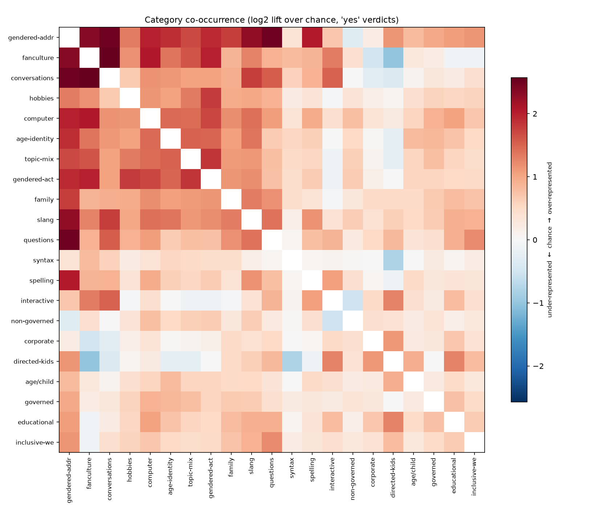

# The classification database in aggregate

A description of the corpus and of the classification database at the level of
counts. Everything here is aggregate, so it holds no page text and no extracted
quotation, and it can be released while the children's writing stays on university
infrastructure. Numbers are read from the published Kidlink database
(`openai/gpt-oss-120b`) with the queries kept alongside this file.

## Scale

The corpus is 278,656 archived pages. Pages longer than the model's context
window are split at paragraph boundaries, which adds 10,318 parts and brings the
total to 288,974 units that were classified. A further 305 files were set aside
before classification as binary content or as text too short or too sparse to
read. Each unit was put to all 21 categories, giving 5,983,493 verdicts, and the
model returned 1,633,180 supporting quotations for the verdicts it made positive.

Across all verdicts, the model said no to 83.9 per cent, yes to 14.6 per cent, and
maybe to 1.5 per cent. The corpus is therefore mostly negative space, which is
what document discovery expects, since any one category describes a small part of
a large and mixed archive.

## What each category matched

The categories range widely in how often they fired, from gendered direct address
at a fifth of a per cent to explicit age and child references at half of all
pages. The counts below are the yes, maybe, and no verdicts for each category,
ordered by how often the category was positive.

| Category | yes | maybe | no | yes rate |
|----------|----:|------:|---:|---------:|
| explicit_age_child_references | 142,971 | 6,999 | 134,799 | 50.2% |
| corporate_register_markers | 107,627 | 978 | 176,297 | 37.8% |
| governed_site | 92,830 | 32,068 | 160,043 | 32.6% |
| educational_register_markers | 88,725 | 1,435 | 194,712 | 31.1% |
| hobbies | 65,899 | 742 | 218,237 | 23.1% |
| first_person_plural_inclusivity | 64,127 | 15,907 | 204,910 | 22.5% |
| topic_mixing_markers | 48,219 | 6,017 | 230,727 | 16.9% |
| age_identity_claims | 39,662 | 4,063 | 241,237 | 13.9% |
| interactive_element_text | 38,390 | 4,267 | 242,319 | 13.5% |
| family | 37,776 | 1,191 | 245,912 | 13.3% |
| gendered_activities_objects | 21,943 | 1,432 | 261,584 | 7.7% |
| question_forms | 21,127 | 175 | 263,636 | 7.4% |
| syntactic_irregularities | 17,773 | 170 | 266,919 | 6.2% |
| conversations | 16,754 | 2,738 | 265,490 | 5.9% |
| youth_slang_informality | 16,410 | 487 | 268,027 | 5.8% |
| non_governed_site | 14,671 | 7,821 | 262,500 | 5.1% |
| directed_at_kids | 12,382 | 676 | 271,900 | 4.3% |
| non_standard_spelling | 11,825 | 1,307 | 271,780 | 4.2% |
| fanculture | 7,510 | 626 | 276,839 | 2.6% |
| computer_culture | 5,975 | 142 | 278,795 | 2.1% |
| gendered_direct_address | 505 | 183 | 284,305 | 0.2% |

## How many categories a page matched

A page matched about three categories on average. The most common outcome was a
single category, and the counts fall away steadily from there, so a page that
matches many categories at once is rare. At the top of the range a handful of
pages matched as many as seventeen of the twenty-one categories. At the bottom,
39,563 pages, 13.7 per cent of the corpus, matched no category at all, which is
the boilerplate and navigation that discovery is meant to leave behind.

| Categories matched | Pages |
|-------------------:|------:|
| 0 | 39,563 |
| 1 | 53,378 |
| 2 | 47,705 |
| 3 | 38,830 |
| 4 | 32,356 |
| 5 | 25,970 |
| 6 | 18,668 |
| 7 | 11,830 |
| 8 | 7,124 |
| 9 | 4,283 |
| 10 | 2,490 |
| 11–17 | 5,310 |

## Supporting quotations and reasoning

The model returned 1,633,180 quotations for its positive verdicts, about 1.7 for
each positive. It also recorded a reasoning trace for every verdict it made, and
the length of that trace tracks how much the verdict asked of it. A no averaged
784 characters of reasoning, a maybe 1,696, and a yes 2,036, so the model wrote
most where it committed and extracted evidence. Within the positive verdicts the
same pattern holds against the evidence itself, since a positive that cited a
quote averaged 2,005 characters of reasoning while a positive that cited none
averaged 1,324. The trace scales with how hard and how well-supported the call is,
and the least-supported positives are also the least reasoned. Whether the
reasoning improved the verdict, rather than only accompanying it, is a question a
gold standard would answer and this description cannot.

## How the categories overlap

The categories are not independent, and the pattern of their overlap is
readable. Counting the pages that two categories both marked yes, and comparing
that against what independence would predict, the pairs that appear together far
more than chance are the informal, child-authored registers.

The heatmap shows the full matrix as lift on a log scale, red where two categories
co-occur above chance and blue where they co-occur below it, with the rows ordered
by similarity so that the block of informal child-authored categories separates
from the formal institutional ones. It is generated by
`figures/cooccurrence_figure.py`.

| Pair (both yes) | Pages | Lift |
|-----------------|------:|-----:|
| fanculture + conversations | 2,622 | 5.9 |
| gendered_activities_objects + fanculture | 2,313 | 4.0 |
| topic_mixing_markers + gendered_activities_objects | 13,256 | 3.6 |
| gendered_activities_objects + hobbies | 17,585 | 3.5 |
| youth_slang_informality + conversations | 3,320 | 3.4 |
| topic_mixing_markers + fanculture | 3,888 | 3.1 |
| question_forms + conversations | 3,675 | 3.0 |

The pairs that appear together less than chance set the formal register against
the informal one, with corporate language avoiding fan culture at a lift of 0.71
and conversation at 0.82. Some verdicts nearly carry others with them, so a page
directed at children also holds an explicit age or child reference 96 per cent of
the time, a page with a self-reported age holds one 89 per cent of the time, and a
page about gendered activities is also about hobbies 80 per cent of the time.
Taken together these overlaps are consistent with the categories tracing one broad
distinction, between informal pages written by or for children and formal pages
from institutions, rather than firing independently of one another.

## Consistency of opposed categories

Two categories, `governed_site` and `non_governed_site`, are meant to be
opposites, one for a site overseen by an institution or a parent and one for a
site that is not. They both fired yes on 6,097 pages, about six per cent of the
pages positive on either. A reader can take this figure two ways, as the
genuinely ambiguous residue where a page carries signs of both, or as a measure of
how often the model contradicts itself on a page, and it is the clearest
self-contained check the database offers on the model's consistency.

## The most-overlapping pages

The overlap tail reaches 17 of the 21 categories, on a single page held twice in
the archive, and the pages near that maximum are the richest in the corpus rather
than the noisiest. They are live chat logs and the self-introductions in which a
child gives a name, an age, a school, a family member, a hobby, and a favourite
band in a few lines, so one page genuinely carries many category features at once.

We audited the three most-overlapping pages verdict by verdict against the
evidence the model cited, forty-nine positive verdicts in all. Forty-three of
them, about 88 per cent, are supported by a quote that genuinely carries the
category's feature. The six that are not fall into the loose-match pattern the
positive-classification check also found, a category firing on an example phrase
used in another sense, such as an "I love" that praises a correspondent's
photographs read as fan culture, or on a passing mention, such as writing a story
on a computer read as computer culture where no game is in view. The
`governed_site` and `non_governed_site` conflict appears here too, and reading it
shows a page carrying evidence both ways, an adult moderator present in the chat
and a remark that no channel operator is needed, so the contradiction is the model
registering genuinely mixed signals rather than firing at random. Overlap
therefore tracks how much a page actually contains, the many-category pages are
the feature-rich child writing the method is meant to surface, and the residual
errors are loose literal matches rather than invention.
